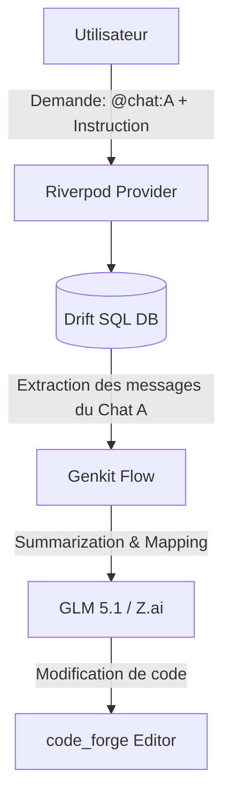

# 🚀 Neo Code : Next-Gen AI-First IDE

**Neo Code** est un environnement de développement expérimental conçu avec Flutter Desktop pour Windows. Plus qu'un simple éditeur de texte, Neo Code est pensé pour être un véritable collaborateur intelligent capable de maintenir un **contexte persistant et croisé entre toutes vos sessions de chat.**

---

## 💡 La Vision : La fin des chats isolés

Le problème des outils comme Cursor ou Copilot est leur mémoire "en silo". Une fois une discussion terminée, l'IA perd souvent le fil des décisions architecturales prises.

**Neo Code** introduit le concept de **Shared Context Management** :

- **Référencement Croisé** : Interrogez un chat passé pour influencer le code actuel (ex: *"En utilisant la logique de validation du Chat A, implémente le formulaire B"*).
- **Mémoire Relationnelle** : Grâce à une base de données SQL locale, l'IDE cartographie les liens entre vos fichiers, vos modifications et vos discussions.

---

## ✨ Fonctionnalités Clés

- **💻 Moteur Neo-Editor** : Utilisation de `code_forge` pour un rendu ultra-rapide et une coloration syntaxique précise.
- **🔗 Cross-Chat Context** : Système de `@chat` permettant d'injecter des résumés de discussions passées directement dans le prompt.
- **🤖 Orchestration via Genkit** : Gestion des flux IA flexible (actuellement optimisé pour **GLM 5.1 via Z.ai**).
- **🗄️ Persistence Drift (SQLite)** : Stockage relationnel de tout l'historique avec recherche plein texte (FTS5).
- **🪟 Expérience Windows Native** : Interface moderne, frameless et optimisée pour Windows via `window_manager`.

---

## 🛠 Tech Stack (2026 Edition)

| Couche | Technologie |
| :--- | :--- |
| **UI Framework** | [Flutter Desktop](https://flutter.dev) |
| **Editor Engine** | [code_forge](https://pub.dev/packages/code_forge) |
| **State Management** | [Riverpod 3.0](https://riverpod.dev) |
| **AI Logic / Flows** | [Firebase Genkit](https://firebase.google.com/docs/genkit) |
| **Database** | [Drift](https://drift.simonbinder.eu/) |
| **Window Mgmt** | [window_manager](https://pub.dev/packages/window_manager) |
| **Theming** | [theme_tailor](https://pub.dev/packages/theme_tailor) |

---

## 🏗 Architecture du Contexte

Neo Code utilise un système de "Context Snapshots" pour ne jamais saturer la fenêtre de contexte du modèle tout en gardant une précision maximale.



---

## 🚀 Installation

1. **Prérequis** :
   - Flutter SDK (Latest Stable)
   - Visual Studio (Desktop development with C++)
   - Clé API Z.ai (BigModel)

2. **Setup** :

   ```bash
   git clone https://github.com/Nirsu/neo_code.git
   cd neo-code
   ```

3. **Génération de code** (Drift, Riverpod, Tailor) :

   ```bash
   dart run build_runner build --delete-conflicting-outputs
   ```

4. **Run** :

   ```bash
   flutter run -d windows
   ```

---

## 📅 Roadmap

- [ ] Support natif du Language Server Protocol (LSP).
- [ ] Auto-Génération de documentation basée sur l'historique des chats.
- [ ] Support du mode hors-ligne avec Ollama / Llama 3.
- [ ] Système de plugins "Agentiques".

---

## 📄 Licence

Ce projet est sous licence MIT.

---
*Développé avec passion pour repousser les limites de l'édition de code.*
